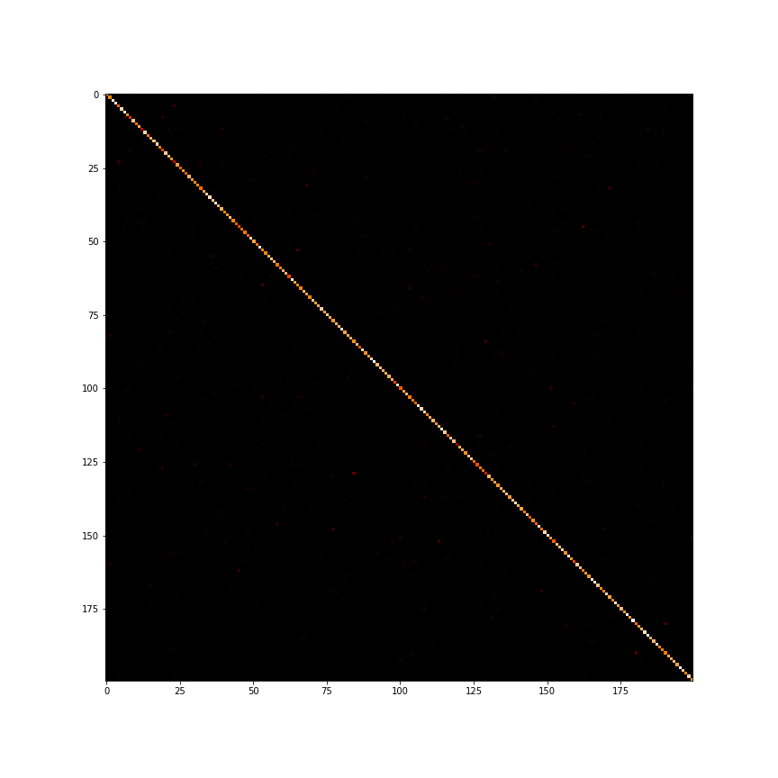
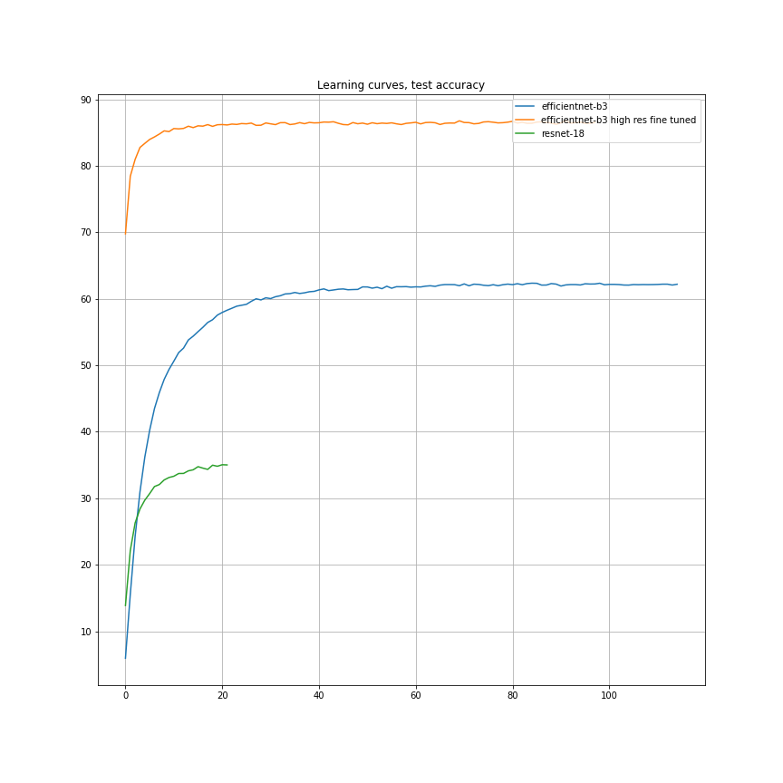

# Results

## Data

The proposed dataset contains 100000 images of 200 classes (500 for each class) downsized to 64×64 colored images. Each class has 500 training images, 50 validation images and 50 test images.

## Decision

To start, I launched baseline and got about 40% score with ResNet-18. The next step was to use pre-trained ResNet with a frozen feature extractor. 
After some experiments with the baseline, I introduced several features to improve the performance:

- Tuned lr and added StepLR scheduler
- Added data augmentation (RandomHorizontalFlip) and resized the image to 224x224. 
- Used pretrained efficientnet-b3 

For the feature extractor, the learning rate was set to 1e-3 and for head - 1e-2. So, I fine-tuned this network and got 0.81 accuracy.

## Confusion matrix

## Test accuracy

## TODO:

- [ ] Efficientnet v2
- [ ] Tune optimizer params
- [ ] Implement some sota for this task (e.g. Direction Concentration Learning)
- [ ] Add more data augmentation (e.g random rotation, random crop, random brightness)